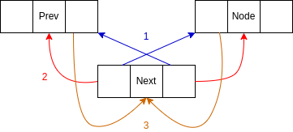

# Insertar nodo en el nodo previo

## Si el nodo es la cabeza


```
Nuevo->prev = Head->prev
Nuevo->next = Head
Head->prev = Nuevo
Nuevo->prev = NULL
```

## Si el nodo no es la cabeza



```
New->next = Prev->next
New->prev = Node->prev
New->next = Node
New->prev = Prev
Prev->next = New
Next->prev = New
```